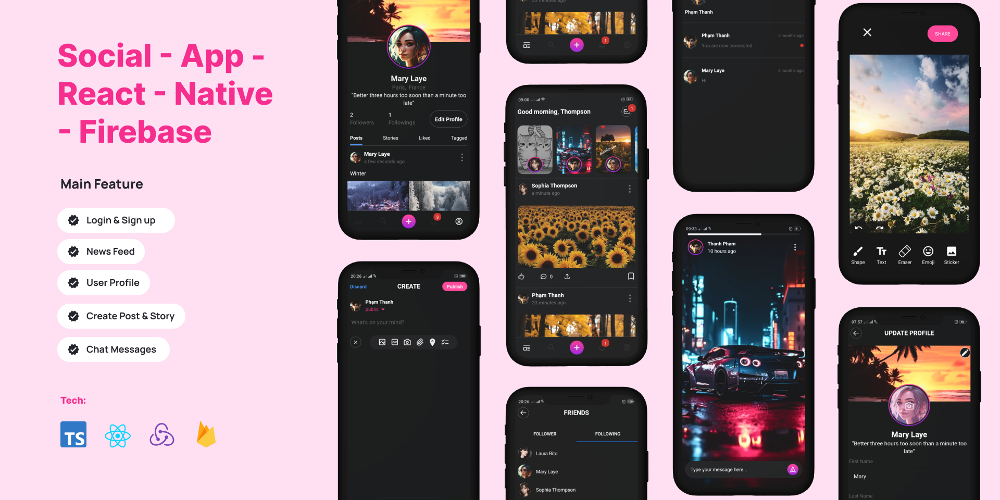

### 📸 [Screenshot](./screenshots/1.png)

---

## 🚀 Features

- **Authentication**: Login & Sign up  
- **News Feed**: View posts from users you follow  
- **Post Management**: Create/Delete Posts (Photo/Video/Giphy/Document/Location/Checklist) and Stories  
- **User Profiles**: View and edit profile information  
- **Push Notifications**: Stay updated with real-time activity alerts  
- **Search**: Find posts, people, photos, and videos  
- **Messaging**: Real-time chat functionality  
- **Follow System**: Follow or unfollow users  

---

## 🛠️ Installation

```bash
git clone https://github.com/thanh-ph2021/Social-App-RN-Firebase.git
cd Social-App-RN-Firebase
npm install
```

## 🔧 Firebase Configuration

1. Visit [Firebase Console](https://console.firebase.google.com/u/0/).
2. Create a new project and download the google-services.json file.
3. Place the file in the ./android/app directory.

## 🏃‍♂️ Run the App

```bash
npm start
```

## 🌍 Location API Configuration

1. Go to [Goong.io](https://goong.io) and create an API Key.
2. Add your `GOONG_API_KEY` to `./src/constants/appInfos`.

## 🎭 Giphy Integration

1. Visit [Giphy Developer Explorer](https://developers.giphy.com/explorer/) to create an API Key.
2. Add your keys to `./src/constants/appInfos`:
  - `ANDROID_GIPHY_API_KEY`
  - `IOS_GIPHY_API_KEY`

## 🔔 Push Notifications

1. Navigate to the `server_push_notification` folder (.NET Core).
2. Replace the `firebase-private-key.json` file with your own.
3. Run the project.

